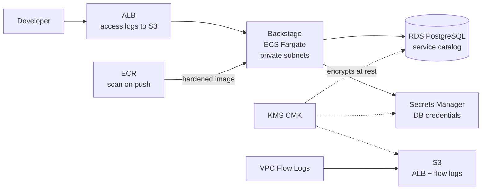

# Internal Developer Platform (IDP)

[](https://github.com/jordann6/internal-developer-platform/actions/workflows/validate.yml)

A security-hardened Internal Developer Platform built on [Backstage](https://backstage.io), deployed to AWS ECS Fargate with RDS PostgreSQL. Features self-service golden path templates that scaffold production-ready microservices with IaC, CI/CD pipelines, and service catalog registration.

## Architecture



| Component | Role |
|---|---|
| **Backstage on ECS Fargate** | Developer portal, software catalog, golden path templates |
| **RDS PostgreSQL** | Service catalog and metadata persistence |
| **ECR** | Container registry with image scanning on push |
| **KMS customer-managed key** | Encryption at rest for every data store |
| **Secrets Manager** | Database credentials, no secrets in code or task definitions |
| **ALB** | Ingress with access logging to encrypted S3 |
| **VPC Flow Logs** | Network audit trail |

## Security Hardening

- Encryption at rest for all data stores via KMS customer-managed key
- Least-privilege IAM with separately scoped task execution and task roles
- Network segmentation: compute and data in private subnets only
- Container hardening: non-root user, all Linux capabilities dropped
- ECR image scanning on every push
- ALB access logs and VPC Flow Logs delivered to encrypted S3
- Zero hardcoded credentials (Secrets Manager + IAM roles)

## Project Structure

```
backstage/                  Backstage app, Dockerfile, production config
scripts/                    deploy.sh / teardown.sh wrappers
terraform/
  environments/dev/         Environment root wiring all modules
  modules/
    networking/             VPC, private subnets, flow logs
    alb/                    Load balancer + access logging
    ecs/                    Fargate service, task definitions, hardening
    ecr/                    Registry with scan-on-push
    database/               RDS PostgreSQL
    secrets/                Secrets Manager wiring
```

## Deploy

```bash
./scripts/deploy.sh
```

## Teardown

```bash
./scripts/teardown.sh
```

Infrastructure is deployed on demand and torn down after use to keep AWS spend near zero.

## Stack

Backstage, Terraform, ECS Fargate, RDS PostgreSQL, ECR, KMS, Secrets Manager, CloudWatch, GitHub Actions
